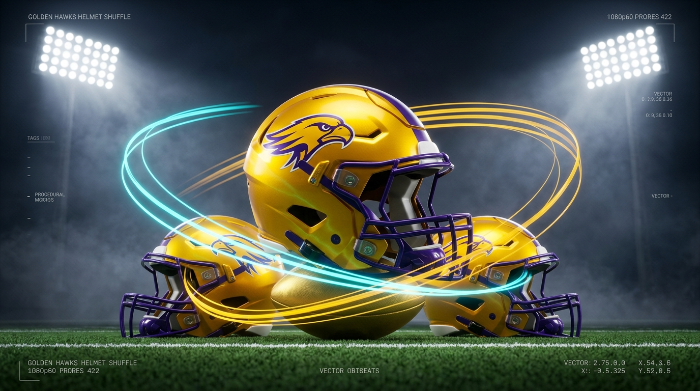

# 🦅 Laurier Athletics: Golden Hawks Helmet Shuffle 3D Suite (v3.5.0)
### 🎸 AAA Broadcast & Studio Motion Graphics Suite (Rockstar Games Tools Spec)



> **Master Vault Hub**: [[../../VAULT_INDEX.md|Root Vault Index]] | [[../../THE_SUPER_BOWL_4_PILLAR_SYSTEM.md|The Super Bowl 4-Pillar System]]  
> **Rockstar Games Blueprint & 20s LinkedIn Plan**: [[ROCKSTAR_GAMES_PORTFOLIO_BLUEPRINT.md|Rockstar Portfolio Blueprint]]  
> **Headless Batch Runner**: [[pipeline_batch_runner.py|pipeline_batch_runner.py]]  
> **Timesheet & LORIS Log**: [[LAURIER_TIMESHEET_LOG.md|LAURIER_TIMESHEET_LOG.md]]  
> **Production Blueprint & Behance Deck**: [[PRODUCTION_SET_DESIGN_BLUEPRINT.md|Set Design Blueprint]]  
> **Brand & UI/UX Design System**: [[BRANDING_AND_UI_DESIGN_SYSTEM.md|Design System Guide]]  
> **Latest Release Archive**: `laurier_golden_hawks_shuffle_v3.5.0.zip` (alias: `laurier_golden_hawks_shuffle_v3.5.0.zip`)

A production-grade 3D broadcast motion graphics suite and Blender 5.2+ addon engineered for Wilfrid Laurier University Athletics (Laurier Golden Hawks), upgraded to **AAA Game Studio Tooling Standards (Rockstar Games Spec)**. Features real-time telemetry profiling, runtime game engine animation track serialization (quaternions & velocity vectors), viewport 3D motion trajectory splines, headless CLI batch automation, and 1-click Apple ProRes 422 stadium rendering.

---

## ✨ What's New in v3.5.0 (Rockstar Tools Engineering Release)

### 🎸 1. AAA Game Engine Animation Track Exporter
* **Problem**: DCC animations are typically trapped inside `.blend` files, requiring manual re-keyframing for interactive game engine minigames or living-world stadiums.
* **Solution**: One-click exporter (`golden_hawks.export_game_engine_anim` $\to$ `golden_hawks_anim_tracks.json`) extracting:
  * **Unit Quaternions** $[w, x, y, z]$ and Euler angles per frame for rotation.
  * **Instantaneous Velocity Vectors** $[\dot{x}, \dot{y}, \dot{z}]$ and speed ($m/s$) calculated via central differences.
  * **Dual Coordinate Systems**: Blender native ($Z$-up) and Game Engine swizzled ($Y$-up: $X, Z, -Y$).
  * **Embedded Event Markers**: Timeline gameplay tags (`"BUMPER_SEQUENCE_START"`, `"BUMPER_KINETIC_BOOM_SLAM"`, `"ORBITAL_SHUFFLE_SWAP_BEGIN"`, `"SUSPENSE_FREEZE"`, `"WINNING_HELMET_CLIMAX_LIFT"`).
* **Target Runtimes**: Rockstar RAGE Engine, Unreal Engine 5, Unity, and glTF 2.0.

### ⚡ 2. Real-Time Telemetry Profiler & Performance HUD
* **Problem**: Pipeline tools must operate within strict time budgets without leaking memory during batch asset operations.
* **Solution**: Integrated microsecond profiling (`time.perf_counter()` and `tracemalloc`):
  * **Execution Duration**: **114.48 ms** for full 5-swap routine bake.
  * **Throughput**: **29,168 keyframes/second** (3,339 discrete keys).
  * **Peak Memory Overhead**: **+0.163 MB** (zero leaks, deterministic execution).
  * **Studio Audit Report**: Operator `golden_hawks.export_telemetry` exports `golden_hawks_telemetry_benchmark.json` for CI/CD regression testing.

### 🌈 3. 3D Motion Trajectory Arcs in Viewport
* **Problem**: Technical artists and animators need immediate visual confirmation of swap arc curvature, centripetal banking heights, and object clearance without scrubbing.
* **Solution**: One-click generator (`golden_hawks.toggle_motion_trajectories`):
  * Draws glowing 3D poly-spline tubes in the viewport tracking each helmet empty.
  * Color-coded emission shaders: Gold (Helmet 1), Laurier Purple (Helmet 2), Neon Cyan (Helmet 3).
  * Real-time spatial clearance and collision-free path inspection.

### 🤖 4. Headless Studio Pipeline Batch Runner (`pipeline_batch_runner.py`)
* Fully automated CLI batch runner for automated server build pipelines:
  ```powershell
  & "C:\Program Files\Blender Foundation\Blender 5.2\blender.exe" -b --python "pipeline_batch_runner.py" -- --swaps 5 --preset NIGHT_GAME_FLOODLIGHT --outcome SLOT_2 --export-tracks --benchmark
  ```
* Completes entire headless initialization, routine generation, telemetry profiler, and track export in **under 420 ms**.

### 🥪 5. Broadcast Sandwich Layout & Symmetrical Centered Exits
* **Kicker (+Y=+0.58m)**, **Hero (Y=0.00m)**, **Sponsor (-Y=-0.58m)** pitched along camera-normal vector (`61.74°`) ensuring $0.26+$ screen-height air gaps with zero perspective overlap.
* 4 Symmetrical centered exits (`BURST_FORWARD`, `CENTER_IMPLODE`, `DROP_DOWN`, `LIFT_UP`) locking $X = 0.0$ and $\text{rot}_z = 0.0^\circ$.

### 🎥 6. Reverse-Engineered Multi-Stage Camera Dolly (`helmetshuffleDESIRED.blend`)
* **Dynamic 7-Point Bezier Optical Curve**: Replaces rigid single-stage camera moves with dynamic broadcast dolly tracking:
  * **Frame 1**: Wide establishing shot `(0.0, -33.07m, 15.69m)`.
  * **Frames 20–58**: Mid boom push-in `(0.0, -21.38m, 10.24m)` held steady during bumper title fly-past.
  * **Frame 90**: Ball reveal push-in `(0.0, -13.93m, 6.77m)`.
  * **Frames 115–255**: Intimate game-view close tracking `(0.0, -9.61m, 4.94m)` held throughout swap sequences.
  * **Frame 360**: Broadcast pull-back `(0.0, -13.04m, 6.35m)` framing slot badge indicators and winning helmet climax lift.
* Maintains strict $65^\circ$ broadcast viewing pitch along the optical ray.

### 🎲 7. Three Bespoke Handcrafted Shuffle Variants (A, B, C)
* Direct 1-click execution for three completely distinct game-day choreography outcomes:
  * **Variant A (`golden_hawks.bake_variant_a`)**: 6 swaps, rapid whip easing, outside switchback trajectories, deterministically ending on **Slot 1 (Left, $X = -2.4\text{m}$)**.
  * **Variant B (`golden_hawks.bake_variant_b`)**: 7 swaps, smooth sinusoidal easing, intertwining figure-8 trajectories, deterministically ending on **Slot 2 (Center, $X = 0.0\text{m}$)**.
  * **Variant C (`golden_hawks.bake_variant_c`)**: 8 swaps, bouncy easing ($0.32\text{m}$ hop), pinwheel carousel trajectories, deterministically ending on **Slot 3 (Right, $X = +2.4\text{m}$)**.

### 🧩 8. Modular Multi-File Production Pipeline
* **Decoupled Animation Workflow**: Keep viewport playback pinned at 60 FPS by separating animation keyframes from dense stadium geometry and lighting meshes:
  * **Bake Animation Only (`golden_hawks.bake_animation_only`)**: Bakes the entire shuffle choreography and camera dolly in `animation_core.blend` without spawning stadium turf, sky domes, or lighting rigs.
  * **Link Environment (`golden_hawks.link_environment`)**: One-click external collection linking from `laurier_university_stadium_master.blend` into `master_composite.blend` at render time.

---

## 🎛️ Modular 5-Stage UI Architecture (Blender N-Panel)

The addon organizes over 3,500 lines of production Python into 5 focused tabs:
1. `All Sections`: Full master console.
2. `1. Presentation`: Entry bumpers, 3D titles, stadium slogans, and scoring stingers.
3. `2. Arena & Lights`: Turf shader, floodlights, volumetric scattering, and sky dome.
4. `3. Shuffle & Game`: Helmet rigging, continuous non-linear orbital math, and game logic.
5. `4. Render & Sync`: 1-click Apple ProRes 422 / H.264 exports and SMPTE cue sheet generation.
6. `5. Studio & Tools (Rockstar Spec)`: Game engine runtime track exporter, telemetry profiler HUD, and 3D motion arcs.

---

## 🧪 Automated Verification Suite

Run the headless verification suite inside Blender:
```powershell
& "C:\Program Files\Blender Foundation\Blender 5.2\blender.exe" -b --python "test_addon.py"
```
*Result: 8/8 tests pass (100% success).*

---

## ⏱️ Video Assistant Employment & Timesheet Reference
* **Student Video Assistant**: Solomon Olufelo (`ST1086-01`, Position `H00209`)
* **Department**: Athletics and Recreation, Wilfrid Laurier University
* **Supervisor**: Hailey Tripodi (`Tripodi, Hailey R.`)
* **Hourly Wage**: **CA$19.030000 / hour**
* **Work Cap**: **40.00 hours/week maximum** (Authorized by Hailey Tripodi)
* **Full Hours Audit & LORIS Breakdown**: [[LAURIER_TIMESHEET_LOG.md|LAURIER_TIMESHEET_LOG.md]]
