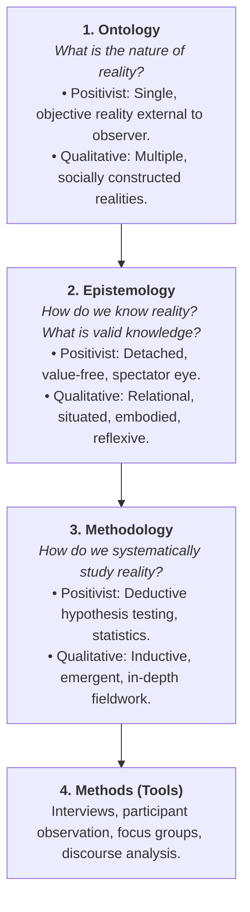

# 🧠 Fall 2026 Master Exam Study Aid & Academic Accelerator
**Student**: Solomon Olufelo (`210729170` | `solufelo`)  
**Institution**: Wilfrid Laurier University, Faculty of Arts (General BA without designation)  
**Registered Courses (1.5 Credits / 100% Senior 200-Level Arts)**:
1. **SY 281 A** — Qualitative Research Methods (Dr. Stephen Svenson) | 30% In-Person Final Exam
2. **FS 209C A** — Food and Identity in Film (Dr. Jing Jing Chang) | Traditional Stream (Tests: 25% + 20%)
3. **KS 205 VA** — Cartoons and Comics (Guy Lefebvre) | 100% Virtual Asynchronous
**Document Companion**: [`FALL_2026_MASTER_EXAM_STUDY_AID.docx`](file:///C:/Users/Administrator/Documents/FALL_2026_MASTER_EXAM_STUDY_AID.docx)

---

## 🧭 Executive Overview: The 12-Hour Study Formula

```
┌─────────────────┬──────────────┬────────────────────────────────────────────────────────┐
│ Course          │ Weekly Budget│ Focus                                                  │
├─────────────────┼──────────────┼────────────────────────────────────────────────────────┤
│ **SY 281 A**    │ 4.5 Hours    │ 1.5h Thursday Lab + 1.5h VDH/Reading + 1.5h Exercises. │
│ **FS 209C A**   │ 4.5 Hours    │ 3h Friday Media/Lecture block + 1.5h Film review notes.│
│ **KS 205 VA**   │ 3.0 Hours    │ 100% Asynchronous: 2h Module readings + 1h discussion. │
├─────────────────┼──────────────┼────────────────────────────────────────────────────────┤
│ **TOTAL TIME**  │ **12.0 Hours**│ 40.0 Hours/Week remains untouched for Athletics & Pay! │
└─────────────────┴──────────────┴────────────────────────────────────────────────────────┘
```

---

# 🏛️ PART 1: SY 281 A — Qualitative Methods (Dr. Stephen Svenson)

## 1.1 The Epistemological Trinity
Qualitative research rests on three interrelated philosophical pillars:



---

## 1.2 Grosfoguel, Epistemicide & The Cartesian Shift
* **Epistemicide**: The systematic destruction, delegitimization, and forced silencing of non-Western knowledge systems, cosmologies, languages, and ways of knowing by an imperial power (coined by Boaventura de Sousa Santos, expanded by Ramón Grosfoguel).
* **The Cartesian Shift**:
  $$\text{Ego Conquiro ("I conquer, therefore I am")} \longrightarrow \text{Ego Cogito ("I think, therefore I am")}$$
  * René Descartes claimed that a solitary European thinker sitting in an armchair could produce universal, objective truth ("I think, therefore I am").
  * Grosfoguel unmasks this: Descartes hid the fact that his "rationality" was backed by 150 years of imperial conquests, slavery, and colonial violence (*ego conquiro*). 
  * This established the **"Point-Zero God-Eye Illusion"**—pretending Western European male thought is universal, neutral, and disembodied, while everyone else is dismissed as "emotional," "irrational," or "superstitious."

### 🧠 Mnemonic: The 4 Great Epistemicides ("A-A-A-W")
1. **A — Al-Andalus (1492)**: Expulsion of Muslims and Jews during the Spanish Reconquista; mass burning of vast Arabic and Hebrew scientific, mathematical, and medical libraries.
2. **A — Americas / Abya Yala (16th Century)**: Physical genocide of Indigenous populations combined with the deliberate burning of sacred Mayan, Aztec, and Andean codices and quipus.
3. **A — African Enslavement (16th–19th Century)**: Transatlantic slave trade; kidnapping millions of Africans, deliberately severing them from their ancestral languages, metallurgy, and cosmologies by reducing humans to brute physical chattel.
4. **W — Witch Hunts in Europe (16th–17th Century)**: Systematic torture and burning of hundreds of thousands of female herbalists, midwives, and healers to destroy autonomous women-centered ecological knowledge and establish patriarchal capitalist science.

---

## 1.3 The Memorial to Sir Wilfrid Laurier (Kamloops, August 25, 1910)
Presented to Prime Minister Sir Wilfrid Laurier by the Chiefs of the Secwépemc (Petit Louis), Nlaka'pamux (John Tetlenitsa), and Syilx (John Chilahitsa), transcribed by Scottish ethnologist ally James Teit:
* **The 3 Indigenous Constitutional Terms**:
  1. ***yiri7 re stsq'ey's-kucw***: Unwritten, ancient oral laws and customs governing Indigenous land ownership and jurisdiction.
  2. ***Stspet'kwle***: Ancient oral histories that preserve the laws across generations.
  3. ***Sk'el'ep***: Coyote, the transformer who established the boundaries, laws, and ethics 5,000+ years ago.
* **The 4 Canadian Mechanisms of Epistemicide**:
  1. **Oral Law Dismissed as Myth**: Canadian courts and officials refused to acknowledge *yiri7 re stsq'ey's-kucw* as valid jurisprudence because it was oral rather than written on parchment.
  2. **Inversion of the Host-Guest Relationship**: Indigenous nations welcomed Europeans as **guests** under reciprocal treaties. Settlers gradually claimed to be "masters," declared Crown sovereignty, and locked sovereign hosts onto tiny reserves without consent.
     > *"They say they have authority over us. They have broken down our old laws and customs... They laugh at our chiefs and brush them aside."* (Chiefs of the Shuswap et al., 1910, p. 6)
  3. **Section 141 of the Indian Act (1927)**: The Canadian government made it a **crime for First Nations to hire a lawyer or raise money for land claims**.
  4. **Residential Schools & Cultural Assimilation**: State-mandated abduction of children to destroy Indigenous languages and ceremonies (Truth and Reconciliation Commission / Justice Murray Sinclair).
* **Patrick Wolfe's Principle**: *"Settler colonialism is a structure, not an event,"* driven by a *"logic of elimination"* to permanently seize the land.

---

## 1.4 Van den Hoonaard Ch. 1: Qualitative vs. Quantitative
* **Quantitative**: Deductive (Top-down: Theory $\rightarrow$ Hypothesis $\rightarrow$ Data $\rightarrow$ Confirmation). Standardized numerical variables.
* **Qualitative**: Inductive (Bottom-up: Observations $\rightarrow$ Patterns $\rightarrow$ Emergent Concepts $\rightarrow$ Grounded Theory). Natural settings, subjective meanings, social processes.
* **The "Widowhood" Example**:
  * *Quantitative Survey*: Counts *how many times* a widow sees her children (assumes more = happier).
  * *Qualitative Interview*: Discovers that for some widows, once-a-month visits give peace and autonomy, while daily visits cause tension. **The subjective meaning matters, not the raw numerical count.**
* **Key Terms**:
  * **Emergent Design**: Research plans adapt in the field as new insights emerge.
  * **Reflexivity**: Researcher continuously acknowledges and analyzes how their own background, gender, race, and positionality shape the research.
  * ***Verstehen* (Max Weber)**: Deep empathetic understanding of social behavior from the perspective of the actor themselves.

---

## 1.5 The Three Paradigms of Knowing (Merrigan et al. — Week 3 Focus)
*This is the direct subject of Thursday's Exercise #2 and the final exam:*

| Dimension | 1. Positivist / Empirical Paradigm | 2. Interpretive Paradigm | 3. Critical Paradigm |
| :--- | :--- | :--- | :--- |
| **Ontology** *(What is reality?)* | Single, objective, measurable reality governed by universal scientific laws. | Multiple, socially constructed realities created through human interaction and symbols. | Reality is structured by power dynamics, ideology, and historical oppression. |
| **Epistemology** *(How is knowledge acquired?)* | Knower and known are separate; objective, value-free observation. | Knower and known are co-creators; situated, relational, and emergent. | Knowledge is never neutral; it either reinforces hegemony or challenges it. |
| **Goal of Research** | **Prediction & Causality**: Discover generalizable laws and test hypotheses. | **Understanding & Meaning**: Interpret subjective human experiences (*Verstehen*). | **Emancipation & Justice**: Expose inequality, challenge hegemony, empower marginalized groups. |
| **Methods Used** | Quantitative surveys, lab experiments, statistical models. | In-depth interviews, participant observation, ethnography. | Critical discourse analysis, participatory action research (PAR), autoethnography. |
| **Role of Values (Axiology)** | Claims to be **value-free** and neutral (detached observer). | Acknowledges that values shape interpretation (**reflexivity**). | Explicitly **value-laden**: Research must take an activist stand to dismantle oppression. |

---

# 🍜 PART 2: FS 209C A — Food and Identity in Film (Dr. Jing Jing Chang)

## 2.1 Theoretical Frameworks: Culinary Semiotics & Film Language
In film studies, food is never just nourishment. It operates as a dense semiotic system (Roland Barthes):
* **Signifier (The Food Object)**: The steaming bowl of ramen, the Peking duck, the raw egg yolk, the fried chicken.
* **Signified (The Cultural Meaning)**: Craftsmanship, social mobility, erotic intimacy, maternal sacrifice, or racial resistance.
* **Mise-en-scène**: Everything before the camera—lighting (warm golden broth lighting vs. harsh fluorescent industrial kitchen), actor blocking, props, and costume.
* **Diegetic vs. Non-Diegetic Sound**:
  * *Diegetic*: Sounds within the story world (slurping noodles, sizzling oil, clattering cleavers).
  * *Non-Diegetic*: Music score added for the audience to guide emotion.
* **Gastro-Nostalgia**: Using culinary rituals to recreate a lost homeland, childhood security, or ancestral connection in the face of modern alienation.

---

## 2.2 Film Analysis #1: *Tampopo* (Juzo Itami, 1985) — Topic 2
* **Genre Hybridity**: The **"Ramen Western"** (a parody of American classic westerns like *Shane*). Two truck drivers (Goro and Gun) wearing cowboy hats ride into town on a milk truck to rescue and train a struggling ramen shop widow (Tampopo).
* **The 5 Key Vignettes to Know for the Test**:
  1. **The Shokunin Spirit (Craftsmanship)**: The opening master-student scene. An elderly master teaches a young apprentice to "apologize to the pork slices," caress the noodles with chopsticks, and treat broth preparation as sacred discipline.
  2. **The Erotic Vignette**: The gangster in the white suit and his mistress sharing food (passing a raw egg yolk mouth-to-mouth without breaking it, a live prawn wriggling on the stomach). Food as visceral, sensual, bodily intimacy.
  3. **The Class & Etiquette Vignette**: The junior salaryman at a high-end French restaurant. While his senior executives can only nervously copy the head manager's generic order, the junior employee orders complex delicacies (quenelles and vintage wine) in fluent French, upending corporate hierarchy.
  4. **The Spaghetti Etiquette Vignette**: Japanese women attending a finishing school to learn "proper" silent Western spaghetti eating, until an American tourist loudly slurps his pasta, prompting the whole class to joyfully slurp.
  5. **Maternal Duty & Mortality**: The dying mother who rises from her deathbed to cook one final fried rice dinner for her family, collapsing dead the moment they begin eating. Food represents female self-sacrifice and domestic sustenance.

---

## 2.3 Film Analysis #2: *Eat Drink Man Woman* (Ang Lee, 1994) — Topic 3 (This Week)
* **The Master Chef Chu (Tao Chu)**: The retired grand chef of Taipei's Grand Hotel who has lost his sense of taste—symbolizing emotional numbness and his inability to express affection verbally to his three modern adult daughters.
* **The Opening 5 Minutes**: A cinematic tour de force of Chinese haute cuisine. Chu scales a live carp, slices pork belly, fills dumplings, and deep-fries ribs with blistering precision. Food is Chu’s **only vocabulary for love**.
* **The Sunday Dinner Table as Battleground**: Every Sunday, the family is forced to sit for an elaborate feast that none of them can emotionally stomach. The table is a site of suppressed tension where each daughter announces life changes (marriage, moving out, pregnancy) that dismantle the traditional Confucian family unit.
* **Tradition vs. Modernity in Diaspora**:
  * *Chu*: Traditional Chinese Confucian order.
  * *Three Daughters*: Modern capitalist Taipei (an airline executive, a Christian teacher, a Wendy's fast-food worker).
* **The Climax & Resolution**: Chu tastes his daughter Jia-Chien's soup in the family kitchen, miraculously regaining his sense of taste and achieving emotional peace.

---

# 🎨 PART 3: KS 205 VA — Cartoons & Comics (Guy Lefebvre)

## 3.1 Scott McCloud: *Understanding Comics*
* **The Gutter**: The blank space between comic panels. McCloud calls the gutter the engine of comics.
* **Closure**: The cognitive act of mentally completing what is happening between two static panels. The reader's imagination turns two still images into continuous action.
* **Amplification through Simplification**:
  * A photorealistic drawing shows *someone else*.
  * A simplified cartoon icon (a circle with two dots and a line) shows *everyone*. Readers project their own identity and universal humanity into the simplified cartoon face.

### The 6 Types of Panel-to-Panel Transitions
1. **Moment-to-Moment**: Very small passage of time; requires minimal closure (e.g., an eye blinking).
2. **Action-to-Action**: A single subject performing distinct actions (e.g., batter swings, ball flies). Classic American superhero comics.
3. **Subject-to-Subject**: Stays within a single scene or idea, moving between different subjects (e.g., speaker talking $\rightarrow$ listener reacting).
4. **Scene-to-Scene**: Significant jumps across time or space (e.g., "Paris, 1940" $\rightarrow$ "New York, 2026").
5. **Aspect-to-Aspect**: Wandering eye; sets a mood, atmosphere, or sense of place (very common in Japanese Manga).
6. **Non-Sequitur**: Panels with no apparent logical or narrative connection, forcing the reader to invent abstract meaning.

---

# 📝 PART 4: Active Recall Practice Exam (12 Questions + Answer Key)

*Test yourself on these 12 questions. Cover the answer with your hand first!*

### Question 1 (SY 281)
**According to Ramón Grosfoguel, René Descartes' philosophical premise *ego cogito* was structurally preceded by:**
* A) *Ego rationalis* (The Enlightenment mind)
* B) *Ego conquiro* ("I conquer, therefore I am")
* C) *Ego fidelis* (The religious believer)
* D) *Ego politicus* (The Machiavellian state)
> **Answer: B**. Grosfoguel demonstrates that before European philosophy imagined a detached universal thinker (*ego cogito*), 150 years of imperial conquerors (*ego conquiro*) established global dominance.

---

### Question 2 (SY 281)
**Which of the following is NOT one of Grosfoguel's four epistemicides of the long 16th century?**
* A) The conquest of Al-Andalus and expulsion of Muslims and Jews (1492)
* B) The destruction of codices in the conquest of the Americas / Abya Yala
* C) The burning of libraries during the French Revolution (1789)
* D) The European witch hunts targeting female healers and midwives
> **Answer: C**. The French Revolution is 18th century. The 4 epistemicides follow the mnemonic **A-A-A-W** (Al-Andalus, Americas, Africa, Witches).

---

### Question 3 (SY 281)
**In *The Memorial to Sir Wilfrid Laurier* (1910), what did Section 141 of the Indian Act do?**
* A) Outlawed First Nations from practicing hunting on crown lands
* B) Criminalized hiring lawyers or raising funds to pursue land claims
* C) Mandated English as the sole language of reserve administration
* D) Dissolved traditional band council governance systems
> **Answer: B**. Enacted in 1927, Section 141 legally prohibited Indigenous communities from hiring legal counsel to fight for their land.

---

### Question 4 (SY 281)
**Patrick Wolfe famously formulated settler colonialism as:**
* A) An isolated historical event completed with Confederation
* B) A commercial trade alliance that dissolved over time
* C) A structure, not an event, driven by a logic of elimination
* D) An extractive colonial model seeking cheap agricultural labor
> **Answer: C**. Settler colonialism is an enduring structure driven by a logic of elimination to permanently possess Indigenous land.

---

### Question 5 (SY 281)
**In Van den Hoonaard's Chapter 1, what was the fundamental limitation of the quantitative survey on widowhood?**
* A) The sample size was too small to reach statistical significance
* B) It counted visit frequency, assuming more visits equaled higher well-being, while ignoring the subjective meaning of the visits
* C) It used open-ended questions that produced unmeasurable qualitative data
* D) The researcher was overly reflexive about their own marital status
> **Answer: B**. Quantitative surveys reduced well-being to an arbitrary number. Qualitative interviews revealed that once-a-month visits provided autonomy, while daily visits caused stress.

---

### Question 6 (SY 281)
**Under Merrigan's *Three Paradigms of Knowing*, which paradigm views reality as socially constructed through interaction and aims for *Verstehen* (subjective understanding)?**
* A) The Positivist / Empirical Paradigm
* B) The Interpretive Paradigm
* C) The Critical Paradigm
* D) The Post-Structuralist Paradigm
> **Answer: B**. The Interpretive paradigm focuses on socially constructed realities and empathetic understanding of meaning.

---

### Question 7 (FS 209C)
**In film semiotics, when an extreme close-up shows steaming pork broth in *Tampopo*, the broth itself is the ________, while the concept of sacred artisanal craftsmanship is the ________:**
* A) Signified; Signifier
* B) Signifier; Signified
* C) Diegesis; Mise-en-scène
* D) Motive; Discourse
> **Answer: B**. The physical object on screen is the **Signifier**; the cultural or emotional meaning is the **Signified**.

---

### Question 8 (FS 209C)
**What genre is Juzo Itami parodying in *Tampopo*?**
* A) The Italian Giallo horror film
* B) The American Western (specifically classic films like *Shane*)
* C) The French New Wave romantic comedy
* D) The Japanese samurai ghost story
> **Answer: B**. *Tampopo* is celebrated as a "Ramen Western," featuring truck drivers in cowboy hats who arrive in town to defend and train a struggling ramen widow.

---

### Question 9 (FS 209C)
**In *Eat Drink Man Woman* (1994), what physical condition afflicts Master Chef Chu, and what does it symbolize?**
* A) Blindness, symbolizing his refusal to look at modern Taipei
* B) Loss of taste, symbolizing emotional numbness and repression toward his daughters
* C) Shaking hands, symbolizing his loss of authority in the Grand Hotel kitchen
* D) Loss of speech, symbolizing traditional Confucian silence
> **Answer: B**. Chu loses his sense of taste and smell. He can execute master technique visually, but cannot taste the food or express warmth to his family.

---

### Question 10 (FS 209C)
**What is the cinematic function of the Sunday family dinner in *Eat Drink Man Woman*?**
* A) A purely joyful reunion where the family celebrates traditional culinary heritage
* B) A site of emotional battle and generational tension where daughters drop life-changing announcements
* C) A commercial demonstration of Taipei's booming restaurant catering economy
* D) A dream sequence illustrating Chu's culinary memories
> **Answer: B**. The Sunday feast is an agonizing ritual of suppressed conflict where the daughters announce marriages and departures, shattering the Confucian family order.

---

### Question 11 (KS 205)
**In Scott McCloud's comics theory, what is "the gutter"?**
* A) The bottom margin of a printed comic book page
* B) The space between comic panels where the reader performs closure
* C) The dialogue balloon containing background sound effects
* D) The dark ink wash used in noir graphic novels
> **Answer: B**. The gutter is the space between panels where the reader's imagination creates closure.

---

### Question 12 (KS 205)
**Why does Scott McCloud argue that readers identify more strongly with cartoon faces than realistic photographs?**
* A) Cartoon faces are cheaper to print and distribute
* B) Realistic photographs are copyrighted, while cartoon faces are public domain
* C) Amplification through simplification: a realistic photo shows a specific stranger, while an abstracted cartoon icon represents universal humanity
* D) Cartoon faces rely exclusively on moment-to-moment transitions
> **Answer: C**. Amplification through simplification allows the reader to project their own identity into the universal cartoon icon.

---

## ⚡ 60-Second Flashcard Review (Quick Recall)

| Concept / Term | Core Fact to Remember |
| :--- | :--- |
| **Boaventura de Sousa Santos** | Coined *epistemicide* (cognitive destruction of knowledge). |
| **Ramón Grosfoguel** | Unmasked Descartes (*ego conquiro* preceded *ego cogito*); 4 epistemicides. |
| **A-A-A-W** | Al-Andalus (1492), Americas (1500s), Africa (1500s–1800s), Witches (1500s–1600s). |
| **Patrick Wolfe** | Settler colonialism is a *structure, not an event* (logic of elimination). |
| *yiri7 re stsq'ey's-kucw* | Ancient Secwépemc oral laws and jurisdiction. |
| *Sk'el'ep* | Coyote, the transformer who established Indigenous laws 5,000+ years ago. |
| **Section 141 (Indian Act)** | 1927 law outlawing hiring lawyers for Indigenous land claims. |
| **Deductive vs. Inductive** | Deductive = Quantitative (top-down). Inductive = Qualitative (bottom-up). |
| *Tampopo* (1985) | The "Ramen Western"; food as craft, eroticism, etiquette, and mortality. |
| *Eat Drink Man Woman* (1994) | Chu's loss of taste; Sunday dinner as generational battlefield; foodways vs diaspora. |
| **The Gutter (McCloud)** | Space between panels where reader performs *closure*. |
| **Amplification through Simplification** | Universal reader identification with cartoon icons. |
