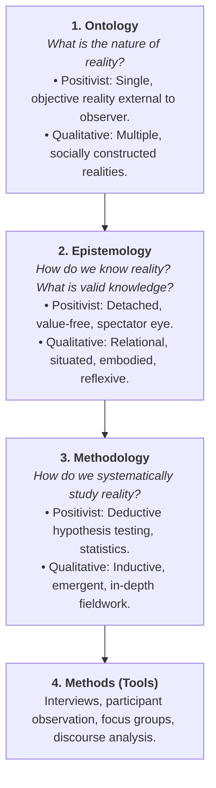

# 🧠 Fall 2026 Master Exam Study Aid & Academic Accelerator (Weeks 1 – 3)
**Student**: Solomon Olufelo (`210729170` | `solufelo`)  
**Institution**: Wilfrid Laurier University, Faculty of Arts (General BA without designation)  
**Registered Courses (1.5 Credits / 100% Senior 200-Level Arts)**:
1. **SY 281 A** — Qualitative Research Methods (Dr. Stephen Svenson) | DAWB 5-127 | 30% In-Person Final Exam
2. **FS 209C A** — Food and Identity in Film (Dr. Jing Jing Chang) | Peters P120 | Traditional Stream (Tests: 25% + 20%)
3. **KS 205 VA** — Cartoons and Comics (Dr. Dru Jeffries) | Virtual Asynchronous | In-Person Exams in LH3094
**Document Companion**: [`FALL_2026_MASTER_EXAM_STUDY_AID.docx`](file:///C:/Users/Administrator/Documents/FALL_2026_MASTER_EXAM_STUDY_AID.docx)

---

## 🧭 Executive Overview: The 12-Hour Study Formula

```
┌─────────────────┬──────────────┬────────────────────────────────────────────────────────┐
│ Course          │ Weekly Budget│ Focus                                                  │
├─────────────────┼──────────────┼────────────────────────────────────────────────────────┤
│ **SY 281 A**    │ 4.5 Hours    │ 1.5h Thursday Lab + 1.5h VDH/Reading + 1.5h Exercises. │
│ **FS 209C A**   │ 4.5 Hours    │ 3h Friday Media/Lecture block + 1.5h Film review notes.│
│ **KS 205 VA**   │ 3.0 Hours    │ Asynchronous modules + Wednesday 5:00 PM activities.   │
├─────────────────┼──────────────┼────────────────────────────────────────────────────────┤
│ **TOTAL TIME**  │ **12.0 Hours**│ 40.0 Hours/Week remains untouched for Athletics & Pay! │
└─────────────────┴──────────────┴────────────────────────────────────────────────────────┘
```

> [!IMPORTANT]
> **CRITICAL UPCOMING IN-PERSON ASSESSMENTS IN LH3094**:
> * **Saturday, October 3, 2026 (8:30 AM – 11:00 AM)**: KS 205 Newspaper Strip Analysis (25% of final grade!)
> * **Friday, October 9, 2026 (11:30 AM – 2:00 PM)**: FS 209C In-Class Test #1 (25% of final grade in Peters P120!)
> * **Friday, October 30, 2026 (7:00 PM – 9:30 PM)**: KS 205 Midterm Exam (30% of final grade in LH3094!)

---

# 🏛️ PART 1: SY 281 A — Qualitative Methods (Dr. Stephen Svenson)

## 1.1 The Epistemological Trinity
Qualitative research rests on three interrelated philosophical pillars:



---

## 1.2 Grosfoguel, Epistemicide & The Cartesian Shift (Week 2)
* **Epistemicide**: The systematic destruction, delegitimization, and forced silencing of non-Western knowledge systems, cosmologies, languages, and ways of knowing by an imperial power (coined by Boaventura de Sousa Santos, expanded by Ramón Grosfoguel).
* **The Cartesian Shift**:
  $$\text{Ego Conquiro ("I conquer, therefore I am")} \longrightarrow \text{Ego Cogito ("I think, therefore I am")}$$
  * René Descartes claimed that a solitary European thinker sitting in an armchair could produce universal, objective truth (*"I think, therefore I am"*).
  * Grosfoguel unmasks this: Descartes hid the fact that his "rationality" was backed by 150 years of imperial conquests, slavery, and colonial violence (*ego conquiro*). 
  * This established the **"Point-Zero God-Eye Illusion"**—pretending Western European male thought is universal, neutral, and disembodied, while everyone else is dismissed as "emotional," "irrational," or "superstitious."

### 🧠 Mnemonic: The 4 Great Epistemicides ("A-A-A-W")
1. **A — Al-Andalus (1492)**: Expulsion of Muslims and Jews during the Spanish Reconquista; mass burning of vast Arabic and Hebrew scientific, mathematical, and medical libraries.
2. **A — Americas / Abya Yala (16th Century)**: Physical genocide of Indigenous populations combined with the deliberate burning of sacred Mayan, Aztec, and Andean codices and quipus.
3. **A — African Enslavement (16th–19th Century)**: Transatlantic slave trade; kidnapping millions of Africans, deliberately severing them from their ancestral languages, metallurgy, and cosmologies by reducing humans to brute physical chattel.
4. **W — Witch Hunts in Europe (16th–17th Century)**: Systematic torture and burning of hundreds of thousands of female herbalists, midwives, and healers to destroy autonomous women-centered ecological knowledge and establish patriarchal capitalist science.

---

## 1.3 The Memorial to Sir Wilfrid Laurier (Kamloops, August 25, 1910)
Presented to Prime Minister Sir Wilfrid Laurier by the Chiefs of the Secwépemc (Petit Louis), Nlaka'pamux (John Tetlenitsa), and Syilx (John Chilahitsa), transcribed by Scottish ethnologist ally James Teit:
* **The 3 Indigenous Constitutional Terms**:
  1. ***yiri7 re stsq'ey's-kucw***: Unwritten, ancient oral laws and customs governing Indigenous land ownership and jurisdiction.
  2. ***Stspet'kwle***: Ancient oral histories that preserve the laws across generations.
  3. ***Sk'el'ep***: Coyote, the transformer who established the boundaries, laws, and ethics 5,000+ years ago.
* **The 4 Canadian Mechanisms of Epistemicide**:
  1. **Oral Law Dismissed as Myth**: Canadian courts and officials refused to acknowledge *yiri7 re stsq'ey's-kucw* as valid jurisprudence because it was oral rather than written on parchment.
  2. **Inversion of the Host-Guest Relationship**: Indigenous nations welcomed Europeans as **guests** under reciprocal treaties. Settlers gradually claimed to be "masters," declared Crown sovereignty, and locked sovereign hosts onto tiny reserves without consent.
     > *"They say they have authority over us. They have broken down our old laws and customs... They laugh at our chiefs and brush them aside."* (Chiefs of the Shuswap et al., 1910, p. 6)
  3. **Section 141 of the Indian Act (1927)**: The Canadian government made it a **crime for First Nations to hire a lawyer or raise money for land claims**.
  4. **Residential Schools & Cultural Assimilation**: State-mandated abduction of children to destroy Indigenous languages and ceremonies (Truth and Reconciliation Commission / Justice Murray Sinclair).
* **Patrick Wolfe's Principle**: *"Settler colonialism is a structure, not an event,"* driven by a *"logic of elimination"* to permanently seize the land.

---

## 1.4 Week 3: Western Inquiry, Motifs & Paradigms of Knowing

### 1. Peter Berger's 4 Motifs of Sociological Consciousness
1. **Debunking Motif**: Looking behind official facade statements and unmasking taken-for-granted institutional assumptions (*"things are not what they seem"*).
2. **Unrespectability Motif**: Looking at society from the bottom up—examining the lifeworlds of marginalized, informal, or hidden sectors, not just elite official institutions.
3. **Relativization Motif**: Recognizing that beliefs, norms, values, and "truths" are culturally and historically relative rather than eternal universal facts.
4. **Cosmopolitanism Motif**: An intellectual and human openness to diverse lifeworlds, exploring alternative perspectives without provincial bigotry.

### 2. Charles Sanders Peirce / Kerlinger: The 4 Ways of Knowing
1. **Method of Tenacity**: Holding firmly to a belief simply because "it has always been believed to be true." Resistant to all conflicting evidence.
2. **Method of Authority**: Accepting knowledge because an authority figure (monarch, state, priest, institution) declared it true.
3. **A Priori Method (Intuition)**: Believing propositions that agree with "pure reason" or seem intuitively self-evident, without empirical testing.
4. **Method of Science**: Systematic, self-correcting empirical investigation where beliefs are constantly tested against observable reality.

### 3. Thomas Kuhn (1970) on Paradigms
A **paradigm** is the entire constellation of beliefs, values, and techniques shared by members of a given scientific community. It dictates what questions are worth asking, what counts as valid data, and how puzzles are solved during periods of "normal science."

### 4. Merrigan & Huston: The Three Paradigms of Knowing
*Core exam concept and direct subject of Exercise #2:*

| Dimension | 1. Discovery / Positivist Paradigm | 2. Interpretive Paradigm | 3. Critical Paradigm |
| :--- | :--- | :--- | :--- |
| **Philosophical Roots** | Rationalism, Empiricism, Logical Positivism, Behaviorism. | Hermeneutics, Phenomenology, Symbolic Interactionism (Blumer 1969), Constructivism. | Critical Theory (Frankfurt School), Semiotics, Postcolonialism, Deconstruction. |
| **Ontology (Nature of Reality)** | Single, objective, measurable reality external to the observer. | Multiple, socially constructed realities created through human symbols and interaction. | Realities are structured by historical power dynamics, ideology, and hegemony. |
| **Role of Knower** | Detached, objective spectator. Knower and known are strictly separate. | Knower and known are interdependent; meaning emerges from their transaction. | Knower is situated and active; reality is perceived through socio-political lenses. |
| **Role of Context** | Decontextualized; seeks universal, generalizable laws. | Contextual and subjective; situated within the actor's *lifeworld*. | Broadly contextual; situated within systemic structures of class, race, and gender. |
| **Goal of Research** | **Prediction & Causality**: Discover generalizable laws and test hypotheses. | **Understanding & Meaning**: Interpret subjective human experiences (*Verstehen*). | **Emancipation & Justice**: Expose inequality, challenge hegemony, transform society. |
| **Role of Values (Axiology)** | Claims to be **value-free** and neutral. | Explicitly recognizes values shape interpretation (**reflexivity**). | Explicitly **value-laden**: Research must take an activist stance to dismantle oppression. |

### 5. Radical Interpretive Inquiry & Lifeworld (Schutz, Weber, Gadamer)
* **Lifeworld (*Lebenswelt*)**: The foundational, taken-for-granted realm of everyday shared experience that underlies all scientific models (Alfred Schutz).
* **Language as Signification**: Meaning cannot be articulated without recourse to language or a shared pool of symbols. Even empirical facts cannot be perceived without a conceptual framework.
* **Knowledge as Transaction**: Knowledge is not a static object waiting to be unearthed; it is the product of an active transaction between a knower and a known.

---

# 🍜 PART 2: FS 209C A — Food & Identity in Film (Dr. Jing Jing Chang)

## 2.1 Film Language & Culinary Semiotics
In film studies, food operates as a dense semiotic system (Roland Barthes):
* **Signifier (The Food Object)**: The physical item shown on screen (ramen broth, steaming water parsley, raw egg yolk, fried chicken).
* **Signified (The Cultural Meaning)**: Craftsmanship, social mobility, erotic intimacy, maternal sacrifice, or racial resistance.
* **Mise-en-scène**: Everything placed before the camera—lighting (warm golden broth vs. cold fluorescent kitchen), actor blocking, costume, and props.
* **Diegetic vs. Non-Diegetic Sound**:
  * *Diegetic*: Sound originating within the film's story world (slurping noodles, sizzling oil, clattering cleavers, flowing creek water).
  * *Non-Diegetic*: Music score added for the audience to guide emotional reaction.
* **Gastro-Nostalgia**: Using culinary rituals to recreate a lost homeland, childhood security, or ancestral connection in the face of modern alienation.

---

## 2.2 Film Analysis #1: *Tampopo* (Juzo Itami, 1985) — Topic 2
* **Genre Hybridity**: The **"Ramen Western"** (a parody of American classic westerns like *Shane*). Two milk-truck drivers in cowboy hats (Goro and Gun) ride into town to rescue and train a struggling ramen shop widow (Tampopo).
* **The 5 Key Vignettes**:
  1. **The Shokunin Spirit (Craftsmanship)**: The master-student opening scene. An elderly master teaches an apprentice to "apologize to the pork slices," caress noodles with chopsticks, and treat broth preparation as sacred discipline.
  2. **The Erotic Vignette**: The gangster in white and his mistress sharing food (passing a raw egg yolk mouth-to-mouth without breaking it). Food as visceral bodily intimacy.
  3. **The Class & Etiquette Vignette**: The junior salaryman at a high-end French restaurant ordering complex delicacies in fluent French while senior executives can only copy the manager. Food upending corporate hierarchy.
  4. **The Spaghetti Etiquette Vignette**: Finishing school women learning silent Western spaghetti eating until an American tourist slurps loudly, prompting joyful slurping.
  5. **Maternal Duty & Mortality**: The dying mother who rises to cook one final fried rice dinner for her family, collapsing dead the moment they begin eating. Food as female domestic sacrifice.

---

## 2.3 Film Analysis #2: *Minari* (Lee Isaac Chung, 2020) — Topic 3 (This Week)
* **Historical & Narrative Setting**: A 1980s Korean immigrant family (Jacob, Monica, Anne, David) relocates from California to rural Arkansas to start a 50-acre Korean vegetable farm catering to incoming Korean immigrants.
* **The Columbian Exchange (Alfred Crosby, 1972)**: The post-1492 transatlantic transfer of plants, animals, people, culture, and disease between the Americas and Afro-Eurasia.
* **Sidney Cheung's Theses on Foodways**:
  * **Authenticity**: A contested social claim and negotiation, *not* an innate property of a dish.
  * **Hybridity**: Diasporic food is a creative new cultural formation, not a "degraded" or "adulterated" version of an original.
  * **Spice Politics**: Ingredients (chili peppers, tomatoes, corn, coffee) moved across empires, functioning as markers of prestige, medicine, grief, and belonging.
* **The Metaphor of *Minari* (Korean Water Parsley)**:
  * Planted by the eccentric grandmother Soon-ja by the muddy creek bed.
  * *Minari* thrives naturally where other cash crops fail, without chemical fertilizers or irrigation.
  * **Three Levels of Signification**:
    1. *Denotative*: A resilient green edible herb used in Korean cooking and soups.
    2. *Connotative*: Immigrant resilience, adaptability, and generational persistence.
    3. *Mythical / Ideological*: The organic grounding of family and ancestral love (Soon-ja) contrasted against Jacob's patriarchal, high-risk pursuit of the capitalist "American Dream" which burns down in the barn fire.
* **Generational & Gender Conflicts Over Food**:
  * *Jacob*: Sees food purely through capitalist agricultural production—gambles family savings on growing Korean vegetables for profit.
  * *Monica*: Desperately craves authentic ingredients (anchovies, red pepper powder brought by grandmother) as emotional lifelines to Korea, terrified of rural isolation.
  * *David (Child)*: Rejects Korean herbal medicine and grandmother's "smell like Korea," preferring American consumerism (Mountain Dew).

---

# 🎨 PART 3: KS 205 VA — Cartoons & Comics (Dr. Dru Jeffries)

## 3.1 Core Comics Theory (Lessons 1 & 2)
* **Comics is a Medium, NOT a Genre**:
  * A medium is the physical and formal material of artistic communication (like cinema, sculpture, literature).
  * A genre is a stylistic or thematic category (superhero, crime, horror, romance, memoir).
  * Dismissing comics as "juvenile superhero stories" confuses a single commercial genre with the entire expressive medium.
* **Scott McCloud's Definition of Comics**:
  $$\text{"Juxtaposed pictorial and other images in deliberate sequence, intended to convey information and/or to produce an aesthetic response in the viewer."}$$
  * Built on Will Eisner's foundational term **"sequential art."**
  * *Juxtaposed*: Adjacent panels placed side-by-side in space.
  * *Deliberate sequence*: Distinct from single-panel cartoons (*The Far Side*, *Family Circus*), which McCloud classifies as single-panel "cartoons" rather than sequential comics.
* **Aaron Meskin's Critique ("Defining Comics")**:
  * Points out the difficulties in establishing necessary and sufficient conditions for comics. Argues McCloud's definition is both too broad (includes instructions manuals, stained glass windows) and too narrow (excludes single-panel editorial cartoons).

---

## 3.2 Historical Antecedents to Comics (Lesson 1)
No medium appears from nowhere. Key historical predecessors:
1. **The Bayeux Tapestry (1070s)**: A 70-meter embroidered linen cloth depicting the Norman Conquest of England in continuous pictorial sequence.
2. **Pre-Columbian Mixtec Codices (14th Century)**: Mesoamerican picture manuscripts (e.g., *8 Deer Jaguar Claw*) telling biographical and military narratives using pictographs in sequential bands.
3. **William Hogarth (1730s)**: English painter/engraver who created sequential moral narratives (*A Harlot's Progress*, *A Rake's Progress*) sold as print suites.
4. **Rodolphe Töpffer (1799–1846)**: Geneva schoolmaster widely regarded as the **father of the modern comic strip** (*Histoire de M. Jabot*, 1833). First to consciously combine caricatural drawing with running text captions to tell narrative stories.
5. **Richard F. Outcault's *The Yellow Kid* (1895)**: Published in Joseph Pulitzer's *New York World* (*Hogan's Alley*). Pioneered mass commercial newspaper comics, color printing, merchandising, and the standardized use of dialogue balloons.

---

## 3.3 Lessing's *Laocoön* & The Spatio-Temporal Hybrid
* In 1766, Gotthold Ephraim Lessing published *Laocoön: An Essay on the Limits of Painting and Poetry*:
  * **Painting = Art of Space**: Employs signs coexisting in space; best suited for depicting static bodies and moments.
  * **Poetry/Literature = Art of Time**: Employs articulate sounds in time; best suited for depicting sequential actions and temporal duration.
* **Why Comics is Revolutionary**: Comics shatters Lessing's boundary! Comics is a **spatialized temporal art**: it represents the passage of time through the juxtaposition of spaces (panels) across the two-dimensional page.

---

## 3.4 Closure & The 6 Types of Panel Transitions
* **The Gutter**: The blank space between comic panels. McCloud calls the gutter the engine of comics.
* **Closure**: The cognitive act of mentally completing what is happening between two static panels. The reader's imagination turns two still images into continuous action.
* **Amplification through Simplification**:
  * A photorealistic drawing shows a specific stranger.
  * An abstracted cartoon icon (a circle with two dots and a line) shows *everyone*. Readers project their own consciousness and universal humanity into the simplified cartoon face.

### The 6 Panel Transitions
```
1. Moment-to-Moment: Tiny duration, minimal closure (an eye blinking).
2. Action-to-Action: Single subject performing distinct actions (bat swings -> ball flies). Classic superhero comics.
3. Subject-to-Subject: Stays within one scene, shifting focus between subjects (speaker talking -> listener reacting).
4. Scene-to-Scene: Significant jumps across time or space ("Paris, 1940" -> "New York, 2026").
5. Aspect-to-Aspect: Wandering eye establishing mood, atmosphere, or setting (prevalent in Japanese Manga).
6. Non-Sequitur: Panels with no apparent narrative connection, forcing reader to construct abstract meaning.
```

---

## 3.5 Preparation for the Newspaper Strip Analysis (Sat, Oct 3 in LH3094)
* **Assessment Value**: **25% of final grade**, written in person on paper in room **LH3094** from 8:30 AM to 11:00 AM.
* **Inspiration & Template**: Mark Newgarden and Paul Karasik's groundbreaking essay ***How to Read Nancy***.
* **Analytical Framework to Apply on Exam Day**:
  1. **Panel-by-Panel Architecture**: Deconstruct the layout (3-panel vs. 4-panel grid). What does each panel do? (Setup $\rightarrow$ Complication $\rightarrow$ Payoff/Gag).
  2. **Line of Sight & Composition**: How do character eyelines, body angles, and prop placements direct the reader's eye across the strip?
  3. **Transitions & Closure**: What transition types occur between Panel 1 $\rightarrow$ 2 and Panel 2 $\rightarrow$ 3? What essential narrative action happens invisibly in the gutter?
  4. **Word-Image Interaction**: Is the text redundant to the image (duo-specific), additive, or contradictory (ironic)?
  5. **Visual Economy**: How does the cartoonist strip away extraneous detail to deliver the gag with maximum clarity?

---

# 📝 PART 4: Active Recall Practice Exam (18 High-Yield Questions)

### Question 1 (SY 281)
**According to Ramón Grosfoguel, René Descartes' philosophical premise *ego cogito* was structurally preceded by:**
* A) *Ego rationalis* (The Enlightenment mind)
* B) *Ego conquiro* ("I conquer, therefore I am")
* C) *Ego fidelis* (The religious believer)
* D) *Ego politicus* (The Machiavellian state)
> **Answer: B**. Grosfoguel demonstrates that before European philosophy imagined a detached universal thinker (*ego cogito*), 150 years of imperial conquerors (*ego conquiro*) established global dominance.

---

### Question 2 (SY 281)
**Peter Berger's sociological motif that involves looking behind official facades and unmasking taken-for-granted institutional claims is known as:**
* A) The Relativization motif
* B) The Cosmopolitanism motif
* C) The Debunking motif
* D) The Unrespectability motif
> **Answer: C**. Debunking refers to the drive to unmask official institutional facades and discover what is really happening beneath accepted claims.

---

### Question 3 (SY 281)
**Under Charles Sanders Peirce's ways of knowing, holding firmly to a belief simply because "it has always been done that way," despite contradictory evidence, is the:**
* A) Method of Tenacity
* B) Method of Authority
* C) A Priori Method
* D) Method of Science
> **Answer: A**. The method of tenacity clings stubbornly to beliefs through habit and tradition, actively shielding itself from contrary facts.

---

### Question 4 (SY 281)
**Under Merrigan's *Three Paradigms of Knowing*, which paradigm views reality as structured by historical power relations and aims for emancipation?**
* A) The Discovery / Positivist Paradigm
* B) The Interpretive Paradigm
* C) The Critical Paradigm
* D) The Empiricist Paradigm
> **Answer: C**. The Critical Paradigm focuses on power, hegemony, and ideological critique with the explicit goal of social justice and emancipation.

---

### Question 5 (SY 281)
**In *The Memorial to Sir Wilfrid Laurier* (1910), what did Section 141 of the Indian Act do?**
* A) Outlawed hunting on crown lands
* B) Criminalized hiring lawyers or raising funds to pursue land claims
* C) Mandated English as the sole language of reserve schools
* D) Dissolved traditional band councils
> **Answer: B**. Enacted in 1927, Section 141 legally prohibited Indigenous communities from hiring legal counsel to fight for their sovereign title.

---

### Question 6 (SY 281)
**What does Alfred Schutz's concept of the "Lifeworld" (*Lebenswelt*) demonstrate regarding qualitative inquiry?**
* A) Quantitative statistics are the only valid way to model objective nature
* B) The external reality of the discovery paradigm rests on a foundation of shared everyday social meanings that science takes for granted
* C) Researchers should eliminate all reflexivity from fieldwork notes
* D) Social actors are passive recipients of external structural forces
> **Answer: B**. Schutz showed that scientific models presuppose the everyday taken-for-granted lifeworld, which interpretive inquiry seeks to explicate.

---

### Question 7 (FS 209C)
**In film semiotics, when an extreme close-up shows steaming pork broth in *Tampopo*, the broth itself is the ________, while artisanal craftsmanship is the ________:**
* A) Signified; Signifier
* B) Signifier; Signified
* C) Diegesis; Mise-en-scène
* D) Motive; Discourse
> **Answer: B**. The physical object on screen is the **Signifier**; the cultural meaning is the **Signified**.

---

### Question 8 (FS 209C)
**What genre is Juzo Itami parodying in *Tampopo* (1985)?**
* A) The Italian Giallo horror film
* B) The American Western (specifically classic films like *Shane*)
* C) The French New Wave romantic comedy
* D) The Japanese samurai ghost story
> **Answer: B**. *Tampopo* is celebrated as a "Ramen Western," featuring truck drivers in cowboy hats who arrive in town to defend and train a struggling ramen widow.

---

### Question 9 (FS 209C)
**In *Minari* (2020), what does the *minari* plant symbolize on an ideological/mythical level?**
* A) The economic failure of Asian agricultural ventures in the American South
* B) The resilience and grounding of maternal/ancestral immigrant survival, critiquing the destructive patriarchal capitalist American Dream
* C) David's complete assimilation into American suburban fast-food culture
* D) The dominance of Western agricultural pesticides over organic Asian farming
> **Answer: B**. *Minari* thrives by the creek without chemical cultivation, representing grandmother Soon-ja's enduring ancestral love and resilience against Jacob's high-risk pursuit of commercial farming.

---

### Question 10 (FS 209C)
**According to Sidney Cheung's scholarship on diasporic foodways, "authenticity" is best understood as:**
* A) An objective, chemically measurable set of native ingredients
* B) A contested social claim and cultural negotiation, not an inherent property of a dish
* C) An unalterable historical formula preserved in culinary archives
* D) A marketing gimmick exclusive to modern fast-food chains
> **Answer: B**. Authenticity is socially constructed and negotiated among communities, diners, and diaspora generations, rather than an innate culinary property.

---

### Question 11 (FS 209C)
**Alfred Crosby's concept of the "Columbian Exchange" (1972) refers to:**
* A) The trade agreements between Canadian fur traders and the Secwépemc
* B) The post-1492 transatlantic transfer of plants, animals, culture, and disease between the Americas and Afro-Eurasia
* C) The export of American fast food to East Asia in the 1980s
* D) The French culinary finishing schools depicted in *Tampopo*
> **Answer: B**. Crosby coined the Columbian Exchange to describe the massive global ecological and agricultural transfer following 1492.

---

### Question 12 (FS 209C)
**In *Minari*, how does young David express his cultural tension with his grandmother Soon-ja?**
* A) He refuses to attend school in Arkansas
* B) He tells her she "smells like Korea" and tricks her into drinking a cup of urine instead of Mountain Dew
* C) He burns down the barn containing Jacob's crops
* D) He demands to return to California to become a farmer
> **Answer: B**. David's initial hostility—complaining she smells like Korea and pulling the urine prank—manifests his internalization of American cultural markers over Korean traditions.

---

### Question 13 (KS 205)
**How does Scott McCloud formally distinguish "comics" from "cartoons"?**
* A) Comics must be published in newspapers; cartoons are on television
* B) Comics is the overarching medium of juxtaposed sequential images; cartooning is an artistic style of visual simplification and iconography
* C) Comics are exclusively humorous; cartoons are serious graphic novels
* D) Cartoons require speech balloons, whereas comics use narration boxes
> **Answer: B**. Comics is the medium (sequential art); cartooning is a style of simplification that amplifies reader identification.

---

### Question 14 (KS 205)
**Which 18th-century philosopher argued in *Laocoön* (1766) that painting is an art of space while poetry is an art of time?**
* A) Immanuel Kant
* B) Gotthold Ephraim Lessing
* C) René Descartes
* D) Jean-Jacques Rousseau
> **Answer: B**. Lessing argued painting operates in space and poetry in time. Comics revolutionizes art by spatializing time across panels.

---

### Question 15 (KS 205)
**Who is widely recognized as the father of the modern comic strip for his work in the 1830s combining caricatural art with running text?**
* A) Richard F. Outcault
* B) William Hogarth
* C) Rodolphe Töpffer
* D) Will Eisner
> **Answer: C**. Geneva schoolmaster Rodolphe Töpffer (*Histoire de M. Jabot*, 1833) created the first intentional modern sequential picture stories.

---

### Question 16 (KS 205)
**In Scott McCloud's 6 panel transition types, which transition is characterized by a "wandering eye" that establishes mood, atmosphere, or a sense of place?**
* A) Moment-to-Moment
* B) Action-to-Action
* C) Subject-to-Subject
* D) Aspect-to-Aspect
> **Answer: D**. Aspect-to-aspect transitions bypass linear narrative progression to explore different aspects of a setting or mood (common in Japanese Manga).

---

### Question 17 (KS 205)
**What 1895 newspaper strip character, created by Richard F. Outcault, popularized color printing and regular speech text in mass newspapers?**
* A) Little Nemo
* B) The Yellow Kid (Mickey Dugan)
* C) Krazy Kat
* D) Nancy
> **Answer: B**. *The Yellow Kid* in *Hogan's Alley* set off the modern commercial newspaper comic strip boom.

---

### Question 18 (KS 205)
**In Mark Newgarden and Paul Karasik's essay *How to Read Nancy*, what is their primary theoretical assertion about comic strips?**
* A) Comic strips are primitive forms of literature lacking serious artistic merit
* B) A strip that appears simple at a casual glance is actually built on thousands of precise formal decisions in framing, line, closure, and visual economy
* C) Nancy should only be evaluated as a commercial merchandising product
* D) Panel gutters should be completely eliminated to improve narrative pacing
> **Answer: B**. Newgarden and Karasik demonstrate that the apparent simplicity of *Nancy* conceals masterclass architectural precision in comic grammar.

---

## ⚡ 60-Second Flashcard Review (Quick Recall)

| Concept / Term | Core Fact to Remember |
| :--- | :--- |
| **Boaventura de Sousa Santos** | Coined *epistemicide* (cognitive destruction of knowledge systems). |
| **Ramón Grosfoguel** | Unmasked Descartes (*ego conquiro* preceded *ego cogito*); 4 epistemicides (**A-A-A-W**). |
| **Peter Berger's 4 Motifs** | **Debunking** (facades), **Unrespectability** (margins), **Relativization** (contingency), **Cosmopolitanism** (openness). |
| **Peirce's Ways of Knowing** | **Tenacity** (stubborn), **Authority** (institutional), **A Priori** (intuition), **Science** (empirical). |
| **Merrigan's 3 Paradigms** | **Discovery** (objective laws), **Interpretive** (*Verstehen* meaning), **Critical** (power & emancipation). |
| *yiri7 re stsq'ey's-kucw* | Ancient Secwépemc oral laws and inherent territorial jurisdiction. |
| **Section 141 (Indian Act)** | 1927 law outlawing hiring lawyers to pursue Indigenous land claims. |
| *Tampopo* (1985) | The "Ramen Western"; food as craft (*shokunin*), eroticism, class mobility, and maternal duty. |
| *Minari* (2020) | Water parsley metaphor: resilient diasporic grounding vs. high-risk capitalist American Dream. |
| **Columbian Exchange** | Crosby (1972): Post-1492 transatlantic transfer of food, plants, and culture. |
| **Cheung on Authenticity** | Authenticity is a contested social claim; hybridity is generative cultural creation. |
| **Scott McCloud's Definition** | Juxtaposed pictorial and other images in deliberate sequence. |
| **The Gutter & Closure** | Blank space between panels where reader's mind bridges the gap (*closure*). |
| **Gotthold Ephraim Lessing** | *Laocoön* (1766): Painting = Space; Poetry = Time. Comics spatialize time! |
| **Rodolphe Töpffer** | Father of modern comic strip (*Histoire de M. Jabot*, 1833). |
| *The Yellow Kid* (1895) | Outcault's pioneer of newspaper comics, color print, and word balloons. |
| *How to Read Nancy* | Newgarden & Karasik: Deconstructing the architectural precision of comic strips. |
| **LH3094 Assessment Dates** | **Sat Oct 3 (8:30–11am)**: Newspaper Strip (25%) \| **Fri Oct 30 (7–9:30pm)**: Midterm (30%). |
