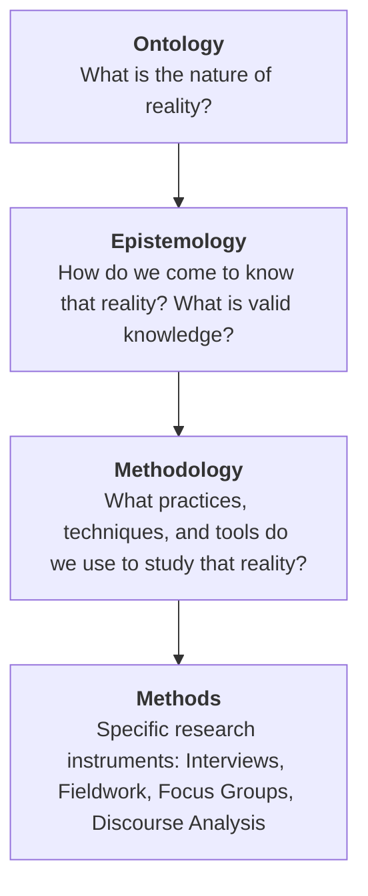

# 📚 SY 281 A: Qualitative Research Methods – Master Study Guide & Knowledge Base

**Student**: Solomon Olufelo (`210729170`)  
**Course**: SY 281 A – Qualitative Research Methods (Fall 2026)  
**Instructor**: Dr. Stephen Svenson (`ssvenson@wlu.ca` | DAWB 5-127)  
**Primary Course Hub**: `projects/learning-education/fall-2026-operating-system/` | Mirrored to `D:\VAULT_HIGH_YIELD\02_AI_Contexts_and_Changelogs\`  

---

## 🎯 Purpose of this Study Guide
This document synthesizes all foundational readings, core theories, and historical documents for **Weeks 1 through 3** of SY 281 A. It is specifically designed to provide deep theoretical understanding with **zero fluff**, so you can ace upcoming research exercises (specifically **Exercise #1: What is Epistemicide?** on Thursday, Sep 17) and prepare for future quizzes and exams without needing to reread dense texts from scratch.

---

## 🏛️ PART 1: Foundations & Decolonizing Methodology (Week 1)

### 1. The Core Trinity: Ontology, Epistemology, Methodology
Qualitative research is not just about "talking to people" or "taking notes"—it is rooted in three philosophical pillars:



* **Ontology**: Beliefs about reality. 
  * *Positivist view*: There is one single, objective reality external to the observer.
  * *Qualitative / Interpretive view*: Reality is socially constructed, multiple, subjective, and negotiated through symbols and interactions.
* **Epistemology**: Theories of knowledge and who can be a "know-er."
  * *Western / Cartesian Epistemology*: Assumes a disembodied, detached "eye of God" perspective where the researcher is an objective, neutral spectator.
  * *Critical / Indigenous Epistemology*: Knowledge is situated, relational, embodied, and inseparable from history, power dynamics, and the land.
* **Methodology**: The overarching strategy connecting research questions to data collection.
* **Decolonizing Research**: Recognizing that Western research methods historically treated Indigenous, colonized, and marginalized peoples as "objects" to be extracted, classified, and controlled rather than sovereign subjects with their own valid epistemologies.

---

### 2. The Memorial to Sir Wilfrid Laurier (Kamloops, August 25, 1910)
* **What is it?** A formal written declaration presented to Canadian Prime Minister Sir Wilfrid Laurier during his pre-election campaign visit to Kamloops, British Columbia.
* **Key Historical Figures**:
  * **Chief Petit Louis** (Secwépemc / Shuswap)
  * **Chief John Tetlenitsa** (Nlaka'pamux / Couteau)
  * **Chief John Chilahitsa** (Syilx / Okanagan)
  * **James Teit**: Scottish-born ethnologist, anti-racist ally, and secretary who transcribed the Chiefs' oral testimony into English.
  * **Father LeJeune**: Catholic priest who assisted with translation.
* **Core Arguments & Sociological Significance**:
  1. **Inherent Sovereignty & Traditional Law**: The Chiefs grounded their authority in ancient law (*yiri7 re stsq'ey's-kucw*), established by *Sk'el'ep* (Coyote) in their oral histories (*Stspet'kwle*).
  2. **The Host-Guest Paradigm**: The Chiefs explained that when European fur traders (the Hudson’s Bay Company) arrived, Indigenous nations acted as benevolent **hosts** to foreign **guests**, operating on mutual reciprocity, trade, and shared land use.
  3. **Betrayal & Encroachment**: As the settler population grew and the colonial government consolidated power, the Crown unilaterally converted the relationship from host-guest to colonial dominance. Settlers took lands, restricted fishing/hunting, imposed reserves, and enacted oppressive legislation (such as Section 141 of the Indian Act, which outlawed Indigenous people hiring lawyers to pursue land claims).
  4. **The Demand for Treaty & Equality**: The Chiefs did not request charity; they demanded legal recognition of their sovereign title, equitable treaties, and honest government-to-government relations.

---

### 3. Justice Murray Sinclair & The TRC Framework
* **Identity**: The Honourable Justice Murray Sinclair (Mizhaki Roodinin) was an Anishinaabe judge, Canadian Senator, and Chief Commissioner of the Truth and Reconciliation Commission of Canada (TRC).
* **The Guiding Principle**:
  > *"It is precisely because education was the primary tool of oppression of Aboriginal people, and miseducation of all Canadians, that we have concluded that education holds the key to reconciliation."*
* **Why this matters for Qualitative Research**:
  * Residential schools and academic disciplines (anthropology, sociology, medicine) historically weaponized "scientific research" to justify assimilation, forced sterilization, and nutritional experiments on Indigenous children.
  * Therefore, academic institutions cannot claim innocence. Contemporary research must actively practice decolonization, reflexivity, and anti-oppressive frameworks.

---

## 📖 PART 2: Qualitative Research in Action – VDH Chapter 1

*Text: Van den Hoonaard, D. K., & Van den Scott, L. J. (2022). Qualitative Research in Action: A Canadian Primer (4th ed.). Oxford University Press.*

### 1. Qualitative vs. Quantitative Research: The Fundamental Distinction

| Dimension | Quantitative Research | Qualitative Research (Van den Hoonaard) |
| :--- | :--- | :--- |
| **Primary Goal** | Testing hypotheses, establishing causal relationships, statistical generalizability. | Understanding everyday life, subjective meanings, social processes, and cultural contexts. |
| **Role of the Participant** | "Subject" responding to standardized, closed-ended survey categories chosen by the researcher. | Active co-creator who **defines what is central and meaningful in their own experience**. |
| **Logic** | **Deductive** (Theory $\rightarrow$ Hypothesis $\rightarrow$ Observation $\rightarrow$ Confirmation). | **Inductive & Emergent** (Observation $\rightarrow$ Pattern recognition $\rightarrow$ Tentative concepts $\rightarrow$ Theory). |
| **Data Nature** | Numbers, counts, percentages, regression models. | Words, field notes, narratives, interview transcripts, visual media, social interactions. |
| **Researcher Role** | Strives for detached, disembodied objectivity (neutral outsider). | **Reflexive**: Researcher acknowledges their positionality, social background, and relationship with participants. |

### 2. The Classic "Widowhood" Example (VDH's Core Illustration)
* **The Quantitative Approach**: A survey measures a widow's "well-being" by asking: *"How often do you see your adult children? (Daily, weekly, monthly)."*
  * *The Flaw*: The researcher assumes that seeing children more often automatically equals high well-being, and that the relationship is inherently positive. It reduces human emotion to an arbitrary numerical count.
* **The Qualitative Approach**: The researcher conducts open-ended in-depth interviews.
  * *The Discovery*: For some widows, seeing children once a month provided peace, autonomy, and independence. For others, daily visits felt suffocating or highlighted familial conflict. The **subjective meaning** of the contact is what determined well-being, not the raw frequency.

### 3. Key Concepts to Master:
* **Inductive Reasoning**: Starting from specific ground-level observations to discover broader patterns and build conceptual frameworks (grounded theory).
* **Emergent Design**: Qualitative research plans are flexible. As researchers encounter new surprises in the field, questions and methods are adapted rather than rigidly locked into pre-existing protocols.
* **Empathy and "Verstehen"**: Weberian concept of deeply understanding social action from the perspective of the actor themselves.

---

## ⚔️ PART 3: Ramon Grosfoguel & Epistemicide (Week 2 Prep – Exercise #1)

*Reading: Ramon Grosfoguel, "The Structure of Knowledge in Westernized Universities: Epistemic Racism/Sexism and the Four Genocides/Epistemicides of the Long 16th Century."*

> [!IMPORTANT]
> **Exercise #1 Alert (Due Thursday, Sep 17)**:
> This reading directly answers the assignment topic: **"What is Epistemicide?"**

### 1. What is Epistemicide?
* **Definition**: Coined by Portuguese sociologist Boaventura de Sousa Santos and expanded by Ramon Grosfoguel, **epistemicide** refers to the **systematic destruction, extermination, delegitimization, and erasure of non-Western knowledge systems, cosmologies, languages, and ways of knowing**.
* Epistemicide is not merely an intellectual disagreement; it is the cognitive counterpart to physical genocide. When colonial empires conquered peoples, they destroyed their libraries, silenced their sages/priests, outlawed their languages, and replaced their knowledge systems with Western Eurocentric rationality.

### 2. The Cartesian Link: From *Ego-Conquiro* to *Ego-Cogito*
* Grosfoguel unmasks René Descartes’ famous philosophical premise: *"Cogito, ergo sum"* (*"I think, therefore I am"*).
* Grosfoguel reveals the hidden historical foundation:
  $$\text{Ego Conquiro ("I conquer, therefore I am")} \longrightarrow \text{Ego Cogito ("I think, therefore I am")}$$
* **The "Point Zero" God-Eye Illusion**: Descartes claimed that a human thinker could produce universal, objective truth by abstracting away the body and social location. Grosfoguel calls this epistemic racism/sexism: it asserts that **only Western European men** possess "disembodied, universal, neutral reason," while women and colonized peoples are dismissed as emotional, irrational, or superstitious.

### 3. The Four Genocides/Epistemicides of the "Long 16th Century":
Grosfoguel argues that modern Western universities are built on four foundational epistemicides:

```
┌────────────────────────────────────────────────────────────────────────────────────────┐
│ 1. Al-Andalus (1492): Expulsion and burning of Arab/Jewish scientific & philosophical   │
│    libraries during the Spanish Reconquista.                                           │
│ 2. The Americas (16th Century): Physical extermination of Indigenous populations and    │
│    the deliberate burning of Mayan, Aztec, and Incan codices and sacred knowledge.    │
│ 3. The Transatlantic Slave Trade: Kidnapping and enslavement of Africans, erasing their │
│    languages, political structures, metallurgical/agricultural knowledge, and humanity.│
│ 4. European Witch Hunts: Torture and burning of millions of women (herbalists, healers, │
│    midwives) to destroy autonomous female knowledge and establish patriarchal science. │
└────────────────────────────────────────────────────────────────────────────────────────┘
```

### 4. The Consequence for Modern Universities:
* **The "Provincial" Canon**: The curriculum of global universities is dominated by thinkers from only 5 countries (France, Germany, Great Britain, Italy, USA), presenting localized Western knowledge as if it were universal truth for the entire planet.
* **The Task of Decolonization**: To move beyond epistemicide, universities must embrace **pluriversality**—recognizing multiple valid, rigorous epistemologies (Indigenous, Black, feminist, Global South) alongside Western methods.

---

## 🧭 PART 4: The Three Paradigms of Knowing (Week 3 Prep – Exercise #2)

*Reading: Merrigan, Huston, & Johnston, "Three Paradigms of Knowing."*

A **paradigm** is an overarching philosophical worldview that dictates what questions can be asked and how they must be answered.

| Feature | 1. Positivist / Empirical Paradigm | 2. Interpretive Paradigm | 3. Critical Paradigm |
| :--- | :--- | :--- | :--- |
| **Ontological Belief** | Singular, objective reality governed by universal scientific laws. | Multiple, socially constructed realities created through human interaction. | Reality is shaped by power dynamics, ideology, and historical oppression. |
| **Primary Goal** | **Prediction & Explanation**: Discover causal relationships and generalizable laws. | **Understanding & Meaning**: Interpret subjective experiences from the actor's perspective. | **Emancipation & Critique**: Expose inequality, resist hegemony, and enact social justice. |
| **Methods Used** | Quantitative surveys, lab experiments, statistical modeling. | Ethnography, in-depth interviews, participant observation, phenomenology. | Critical discourse analysis, autoethnography, participatory action research (PAR). |
| **Role of Values** | Claims to be **value-free** and completely objective. | Acknowledges that values shape how meaning is interpreted (**reflexivity**). | Explicitly **value-laden**: Aimed at transforming society and challenging oppressive structures. |

---

## 🎮 BONUS CHEAT SHEET: ML 103 Working Definitions (Due Sep 28)

For your assignment in `ML 103` (Digital Valhallas), you are required to define three terms with personal pop-culture examples:

### 1. Medievalism
* **Definition**: The reception, recreation, interpretation, and ongoing cultural reimagining of the Middle Ages in post-medieval societies (in film, novels, architecture, politics, and video games), fundamentally distinct from the actual historical Middle Ages.
* **Key Thinker**: Umberto Eco (*"Ten Little Middle Ages"*). Eco notes that the Middle Ages are constantly reinvented to serve contemporary desires—from romanticized chivalry to brutal grimdark fantasy.
* **Pop Culture Example**: *The Elder Scrolls V: Skyrim* or *Game of Thrones*. (They construct a stylized "fantasy medieval" aesthetic of round shields, fur collars, and longhalls that speaks to 21st-century power fantasies rather than actual 9th-century agrarian Norse reality).

### 2. Borealism
* **Definition**: The exoticization, romanticization, and cultural construction of the "Far North" as an empty, sublime, hyper-masculine, ice-clad realm of primal survival, purity, and mythic violence, viewed from the perspective of external spectators.
* **Key Context**: Alicia McKenzie and E.R. Truitt (*"Fantasy North"*).
* **Pop Culture Example**: *God of War (2018)* or *Assassin's Creed: Valhalla*. (Depicting Scandinavia as perpetually frozen snowdrifts populated by muscular, brooding berserkers, ignoring Scandinavia's rich agrarian networks, trade, and vibrant domestic arts).

### 3. Historiography
* **Definition**: The critical study of the methodology, historical context, and ideological biases embedded in the writing and representation of history itself—recognizing that history is never a neutral recording of facts, but an active narrative shaped by who is telling the story.
* **Key Context**: Alicia McKenzie’s critique of "progressive Viking" morality in *Assassin's Creed: Valhalla*.
* **Pop Culture Example**: The "Animus" mechanic in *Assassin's Creed*. (The game explicitly acknowledges that history is a simulated memory layer being accessed and re-rendered by modern software with built-in ideological filters).

---

## ⚡ Summary Checklist for Solomon
1. **Tonight (Sep 14 @ 11:59 PM)**: Submit SY 281 Quiz #1 using the verified answers.
2. **Wednesday (Sep 16)**: Final financial decision point on ML 103 (100% refund drop deadline).
3. **Thursday (Sep 17 @ 8:30 AM DAWB 5-127)**: Attend SY 281 Lab for **Exercise #1: What is Epistemicide?** (Use Part 3 of this guide to write your submission).
4. **Friday (Sep 18 @ 11:30 AM P120)**: Attend FS 209C (*Tampopo* screening & discussion).
