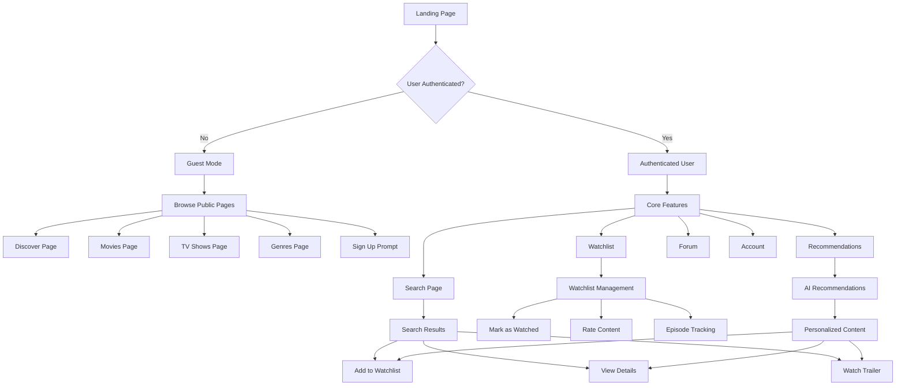

# CinemaVerse User Experience Control Flow

## 🎯 User Journey Overview



## 📱 Page Structure & Navigation

### Public Pages (No Auth Required)
```
Landing Page (/) → Header + Guest Banner
├── Discover (/discover) → Trending Content
├── Movies (/movies) → Movie Catalog
├── TV Shows (/tv-shows) → TV Show Catalog
└── Genres (/genres) → Genre-based Browsing
```

### Authenticated Pages (Auth Required)
```
Dashboard → Header + User Menu
├── Search (/search) → Content Search + Trending
├── Watchlist (/watchlist) → Personal Collection
├── Recommendations (/recommendations) → AI Suggestions
├── Forum (/forum) → Community Discussions
└── Account (/account) → User Settings
```

## 🎨 Design System Foundation

### Color Palette
- **Primary**: Blue (#3B82F6) - Trust, Professionalism
- **Secondary**: Yellow (#F59E0B) - Energy, Entertainment
- **Accent**: Purple (#8B5CF6) - Creativity, Innovation
- **Neutral**: Gray Scale (#F9FAFB to #111827)

### Typography
- **Headings**: Inter, Bold (600-700)
- **Body**: Inter, Regular (400)
- **UI Elements**: Inter, Medium (500)

### Layout Principles
- **Container**: max-w-7xl, centered
- **Spacing**: Consistent 8px grid system
- **Responsive**: Mobile-first approach
- **Consistency**: Same header across all pages

## 🔄 User Interaction Flow

### Content Discovery Flow
1. **Landing Page** → Show trending content carousel
2. **Public Pages** → Allow browsing without auth
3. **Sign Up Prompt** → Non-intrusive, value-focused
4. **Search Page** → Show trending before search
5. **Content Cards** → Multiple action buttons

### Content Interaction Flow
1. **Browse** → Discover content through various pages
2. **Search** → Find specific content
3. **Preview** → Watch trailer, read details
4. **Save** → Add to watchlist
5. **Track** → Mark progress, rate content
6. **Share** → Social sharing options

### Error Handling Flow
1. **Graceful Degradation** → Show alternatives when content fails
2. **Human-Friendly Messages** → Clear, helpful error text
3. **Recovery Options** → Retry, alternative content, support
4. **Loading States** → Skeleton screens, progress indicators

## 🎬 Content Card Standard

### Required Elements
- **Poster Image** → High-quality, fallback placeholder
- **Title** → Clear, readable, truncated if needed
- **Rating** → Star display with score
- **Release Year** → Simple date display
- **Media Type Badge** → Movie/TV indicator
- **Action Buttons** → Watch Trailer, Add to Watchlist, View Details

### Interactive States
- **Hover** → Scale poster, show overlay
- **Loading** → Skeleton animation
- **Error** → Placeholder image
- **Success** → Visual feedback for actions

## 🚀 Performance & UX Goals

### Loading Performance
- **First Contentful Paint**: < 1.5s
- **Largest Contentful Paint**: < 2.5s
- **Cumulative Layout Shift**: < 0.1

### User Experience Metrics
- **Time to Interactive**: < 3s
- **Error Rate**: < 1%
- **User Engagement**: > 60% return rate
- **Conversion Rate**: > 15% signup rate

### Accessibility Standards
- **WCAG 2.1 AA** compliance
- **Keyboard Navigation** support
- **Screen Reader** compatibility
- **Color Contrast** ratios
- **Focus Management** for modals

## 🔧 Technical Implementation

### Component Architecture
```
Shared Components
├── Header (consistent across pages)
├── ContentCard (standardized design)
├── TrailerModal (reusable)
├── ShareButton (reusable)
└── LoadingStates (skeleton screens)

Page Components
├── LandingPage (hero + carousel)
├── DiscoverPage (trending + filters)
├── MoviesPage (catalog + search)
├── TVShowsPage (catalog + search)
├── SearchPage (search + trending)
└── RecommendationsPage (AI + personalization)
```

### State Management
- **Global**: User auth, navigation state
- **Local**: Page-specific filters, search queries
- **Cache**: TMDB data, user preferences
- **Persistence**: Watchlist, user settings

### API Integration
- **TMDB**: Content data, images, trailers
- **OpenRouter**: AI recommendations
- **Local**: User data, watchlist management
- **Error Handling**: Graceful fallbacks, retry logic 